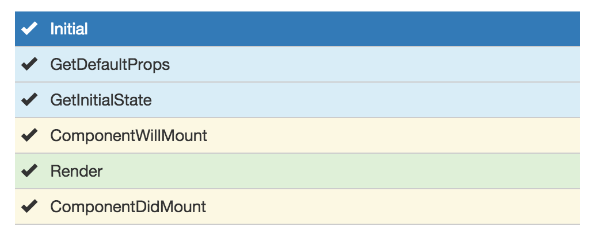

title: React 101
author:
  name: Lin Dong
  twitter: _ldong
  url: http://github.com/ldong
style: style.css
layout: layout.mustache
template: default.mustache
output: index.html
controls: true

--

#  React 101
## Lets talk about React
## 1/16/2016

--

## React Outline

* What
* Why
* How
* Demo

--

## **What is React?**
* [React is simple, declarative and composable view-only JavaScript library.](https://facebook.github.io/react/docs/why-react.html)
* It was developed and used by Facebook starting 2013.

--

## **Why use it?**
* Learning Curve is shallow, easy to learn
* JavaScript to manipulate DOM is **slow**
    
* Healthy Eco-System, React-Native, "Learn Once"

--

### **React is here to help**

By implementing and leverage [virtual dom](http://tonyfreed.com/blog/what_is_virtual_dom), React can change the parts
that need to be changed and then batch save to the real DOM tree. i.e.


--

### **React under the hood**
What makes it really fast:

1. Efficient *diff* algorithms.

    

2. Batching DOM read/write operations.
3. Efficient update of sub-tree only.

--

### Show Cases

Facebook, Instagram, WalMart, Wordpress, and [more](http://builtwithreact.io/)

--

## **How to use it?**
1. Must include these two libraries in order to use [React](https://facebook.github.io/react/)

    ```text
    https://fb.me/react-0.14.6.js
    https://fb.me/react-dom-0.14.6.js
    ```

2. It is essential to know JSX but not required.
    ```
    https://cdnjs.cloudflare.com/ajax/libs/babel-core/5.8.24/browser.js
    ```

3. Sample: [w/](https://jsfiddle.net/reactjs/69z2wepo/), [w/o](https://jsfiddle.net/reactjs/5vjqabv3/), [w/ and w/o JSX side by side](http://tinyurl.com/j8ahhyt)

--
### [React Life Cycle](https://facebook.github.io/react/docs/component-specs.html)



--
### [React Life Cycle](https://facebook.github.io/react/docs/component-specs.html)


--

### React Key Concept

1. Web Page is predefined by a FSM(finite state machine)
    
2. Actions(Interaction or API) change Web Page

--

## Demo

* [Todo List Demo](https://jsfiddle.net/ldong/apao5wse/3/)

--

## Summary

* What
* Why
* How

--

### Reference
* [Perf Benchmark](http://www.domgan.com/benchmark/)
* [DOM access optimization](http://www.phpied.com/dom-access-optimization/)
* [High Performance JavaScript By Zakas p37](http://shop.oreilly.com/product/9780596802806.do)
* [React Component Specs and Lifecycle](http://facebook.github.io/react/docs/component-specs.html)
* [React’s diff algorithm](http://calendar.perfplanet.com/2013/diff/)
* [The difference between Virtual DOM and DOM](http://reactkungfu.com/2015/10/the-difference-between-virtual-dom-and-dom/)
* [为什么说 DOM 操作很慢](https://leozdgao.me/why-dom-slow/)
* [React源码剖析系列 － 生命周期的管理艺术 - pure render - 知乎专栏](http://zhuanlan.zhihu.com/purerender/20312691)
* [React为什么这么火](http://www.dang-jian.com/labs/why-react/#/title)
* [React JS Tutorial and Guide to the Gotchas](https://zapier.com/engineering/react-js-tutorial-guide-gotchas/)
* [HTML to JSX Converter](https://facebook.github.io/react/html-jsx.html)
